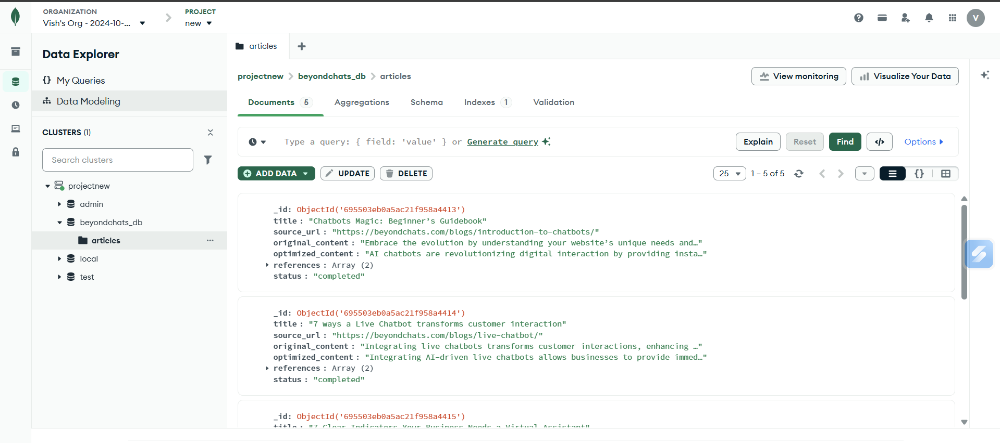

# BeyondChats Article Optimizer

An intelligent article optimization system that scrapes articles from BeyondChats blogs, uses AI to rewrite and optimize them for SEO, and displays them in a professional web interface.

## 📋 Table of Contents
- [Features](#features)
- [Tech Stack](#tech-stack)
- [Architecture](#architecture)
- [Prerequisites](#prerequisites)
- [Local Setup Instructions](#local-setup-instructions)
- [Environment Variables](#environment-variables)
- [Running the Application](#running-the-application)
- [Project Structure](#project-structure)
- [API Endpoints](#api-endpoints)
- [Development Journey](#development-journey)
- [Live Demo](#live-demo)

---

## ✨ Features

### Phase 1: Web Scraping & Storage
- Scrapes the 5 oldest articles from BeyondChats blogs
- Stores articles in MongoDB with original content
- RESTful CRUD API for article management

### Phase 2: AI-Powered Optimization
- Searches article titles on Google using SerpAPI
- Scrapes top 2 ranking articles for reference
- Uses Google Gemini AI to rewrite articles with:
  - Improved SEO structure
  - Better formatting (headings, bullet points)
  - Professional tone
  - Citations from reference articles
- Automatically updates articles in database

### Phase 3: Modern Web Interface
- Responsive React frontend with Tailwind CSS
- Toggle between original and AI-optimized versions
- Beautiful markdown rendering
- Reference links with hover effects
- Mobile-friendly design

---

## 🛠 Tech Stack

### Backend (Python - FastAPI)
- **FastAPI**: Modern Python web framework
- **Motor**: Async MongoDB driver
- **BeautifulSoup4**: Web scraping
- **Pydantic**: Data validation

### Optimization Script (Node.js)
- **Node.js**: JavaScript runtime
- **Axios**: HTTP client
- **Cheerio**: HTML parsing
- **Google Gemini AI**: Content generation
- **SerpAPI**: Google search integration

### Frontend (React)
- **React 19**: UI library
- **Vite**: Build tool
- **Tailwind CSS**: Styling
- **react-markdown**: Markdown rendering
- **Lucide React**: Icons

### Database
- **MongoDB**: NoSQL database

---

## 🏗 Architecture

```
┌─────────────────────────────────────────────────────────────────┐
│                         USER INTERFACE                          │
│                     (React + Tailwind CSS)                      │
│  ┌──────────────┐  ┌──────────────┐  ┌──────────────┐           │
│  │   Article    │  │   Toggle     │  │  References  │           │
│  │    List      │  │   Original/  │  │    Display   │           │
│  │              │  │   Optimized  │  │              │           │
│  └──────────────┘  └──────────────┘  └──────────────┘           │
└─────────────────────────────────────────────────────────────────┘
                              ↕
┌─────────────────────────────────────────────────────────────────┐
│                     FASTAPI BACKEND (Python)                    │
│  ┌──────────────────────────────────────────────────────────┐   │
│  │  GET /articles      - Fetch all articles                 │   │
│  │  PUT /articles/{id} - Update article                     │   │
│  │  POST /articles/{id}/optimize - Trigger optimization     │   │
│  └──────────────────────────────────────────────────────────┘   │
└─────────────────────────────────────────────────────────────────┘
                              ↕
┌─────────────────────────────────────────────────────────────────┐
│                      MONGODB DATABASE                           │
│  ┌──────────────────────────────────────────────────────────┐   │
│  │  Articles Collection:                                    │   │
│  │  - title, original_content, source_url                   │   │
│  │  - optimized_content, references, status                 │   │
│  └──────────────────────────────────────────────────────────┘   │
└─────────────────────────────────────────────────────────────────┘
                              ↕
┌─────────────────────────────────────────────────────────────────┐
│                 NODE.JS OPTIMIZATION SCRIPT                     │
│  ┌──────────────────────────────────────────────────────────┐   │
│  │  1. Fetch articles from API                              │   │
│  │  2. Search Google for article title (SerpAPI)            │   │
│  │  3. Scrape top 2 results (Cheerio)                       │   │ 
│  │  4. Generate optimized content (Gemini AI)               │   │
│  │  5. Update article via API                               │   │
│  └──────────────────────────────────────────────────────────┘   │
└─────────────────────────────────────────────────────────────────┘
                     ↕                    ↕
        ┌─────────────────────┐  ┌─────────────────────┐
        │   SERPAPI           │  │  GOOGLE GEMINI AI   │
        │  (Google Search)    │  │  (Content Gen)      │
        └─────────────────────┘  └─────────────────────┘
```

### Data Flow

1. **Initial Scraping** (Startup)
   - Python backend scrapes 5 oldest articles from BeyondChats
   - Stores in MongoDB with original content

2. **Optimization Process** (Node Script)
   - Fetches unprocessed articles from API
   - Searches Google for each article title
   - Scrapes reference articles
   - Sends to Gemini AI for rewriting
   - Updates database with optimized content

3. **User Interface** (React)
   - Fetches articles from API
   - Displays original and optimized versions
   - Shows references with links

---

## 📋 Prerequisites

Before you begin, ensure you have the following installed:

- **Python 3.8+** ([Download](https://www.python.org/downloads/))
- **Node.js 16+** and npm ([Download](https://nodejs.org/))
- **MongoDB 5.0+** ([Download](https://www.mongodb.com/try/download/community))
- **Git** ([Download](https://git-scm.com/downloads))

### API Keys Required

1. **Google Gemini API Key**
   - Get it from: https://aistudio.google.com/app/apikey
   
2. **SerpAPI Key**
   - Get it from: https://serpapi.com/
   - Free tier: 100 searches/month

---

## 🚀 Local Setup Instructions

### 1. Clone the Repository

```bash
git clone https://github.com/Vishv510/BeyondChats-assignment.git
cd beyondchats-article-optimizer
```

### 2. Setup Python Backend

```bash
# Navigate to backend directory
cd backend-python

# Create virtual environment
python -m venv venv

# Activate virtual environment
# On Windows:
venv\Scripts\activate
# On Mac/Linux:
source venv/bin/activate

# Install dependencies
pip install fastapi uvicorn motor python-dotenv beautifulsoup4 requests pydantic

# Create .env file (optional, if using custom MongoDB URI)
echo "MONGODB_URI=mongodb://localhost:27017/artical" > .env

# Start this 
 uvicorn main:app --reload
```
## start other terminal

### 3. Setup Node.js Optimization Script

```bash
# Navigate to Node script directory
cd Node_scrape

# Install dependencies
npm install

# Create .env file
cat > .env << EOL
GEMINI_KEY=your_gemini_api_key_here
SERP_API_KEY=your_serpapi_key_here
EOL

# run the terminal
npm run dev
```
## start other terminal

### 4. Setup React Frontend

```bash
# Navigate to frontend directory
cd frontend

# Install dependencies
npm install

# Go back to root
npm run dev
```

---

## 🔑 Environment Variables

### Backend Python (.env in `backend-python/`)
```env
MONGODB_URI=mongodb://localhost:27017/artical
```

### Node Script (.env in `Node_scrape/`)
```env
GEMINI_KEY=your_google_gemini_api_key
SERP_API_KEY=your_serpapi_key
```

---

## ▶️ Running the Application

**Terminal 1 - MongoDB** (if not running as service):
```bash
mongod
```

**Terminal 2 - Python Backend**:
```bash
cd backend-python
# Activate venv first (see setup instructions)
uvicorn main:app --reload
```

**Terminal 3 - Node Optimization Script**:
```bash
cd Node_scrape
npm run dev
```

**Terminal 4 - React Frontend**:
```bash
cd frontend
npm run dev
```

### Access the Application

- **Frontend**: http://localhost:5173
- **Backend API**: http://localhost:8000

---

## 📁 Project Structure

```
beyondchats-article-optimizer/
│
├── backend-python/              # FastAPI Backend
│   ├── main.py                  # API endpoints
│   ├── scraper.py               # Web scraping logic
│   ├── model.py                 # Data models
│   └── .env                     # Environment variables
│
├── Node_scrape/                 # Node.js Optimization Script
│   ├── index.js                 # Main orchestrator
│   ├── services/
│   │   ├── articleService.js    # API calls
│   │   ├── googleService.js     # Google search
│   │   ├── scrapeService.js     # Content scraping
│   │   └── llmService.js        # AI generation
│   ├── package.json
│   └── .env                     # API keys
│
├── frontend/                    # React Frontend
│   ├── src/
│   │   ├── components/
│   │   │   ├── Header.jsx
│   │   │   ├── ArticleList.jsx
│   │   │   └── ArticleViewer.jsx
│   │   ├── pages/
│   │   │   └── Dashboard.jsx
│   │   ├── api/
│   │   │   └── articles.js
│   │   ├── App.jsx
│   │   └── main.jsx
│   ├── package.json
│   └── tailwind.config.js
│
└── README.md                    # This file
```

---

## 🔌 API Endpoints

### FastAPI Backend

| Method | Endpoint | Description |
|--------|----------|-------------|
| GET | `/articles` | Fetch all articles |
| PUT | `/articles/{id}` | Update article by ID |
| POST | `/articles/{id}/` | Trigger optimization for specific article |


### Example Requests

**Get all articles:**
```bash
curl http://localhost:8000/articles
```

---

## 🌐 Live Demo

**Live Link**: [Your Deployed Frontend URL]

### How to Test the Application

1. **View Articles**
   - Open the live link
   - See list of 5 articles on the left sidebar
   - Click any article to view it

2. **Compare Versions**
   - Click "AI Optimized" button to see the rewritten version
   - Click "Original" to see the original scraped content
   - Notice improved formatting, headings, and structure

3. **Check References**
   - Scroll to bottom of optimized articles
   - See clickable reference links to source articles
   - Hover over reference cards for interaction

### What to Look For

- ✨ **Original Content**: Raw scraped text from BeyondChats
- 🤖 **AI-Optimized**: Rewritten with:
  - Clear summary at the top
  - Proper H2/H3 headings
  - Bullet points for lists
  - Bold keywords
  - SEO-friendly structure
- 📚 **References**: Links to top-ranking Google articles used as inspiration

---

### Node Script Manual Run
```bash
cd Node_scrape
npm start
# Watch console for scraping and AI generation logs
```

### Frontend Development
```bash
cd frontend
npm run dev
# Open http://localhost:5173
```

---

## 📄 License

This project was created as part of the BeyondChats technical assignment.

---

## 🙏 Acknowledgments

- BeyondChats for the assignment opportunity
- Google Gemini AI for content generation
- SerpAPI for search functionality
- MongoDB, FastAPI, React communities for excellent documentation


### photo / screenshots

## local terminal 


---

## frontend output
- screen (large)


- screen (large - ai generated, optimize content)


- screen ( mobile )


## database output



